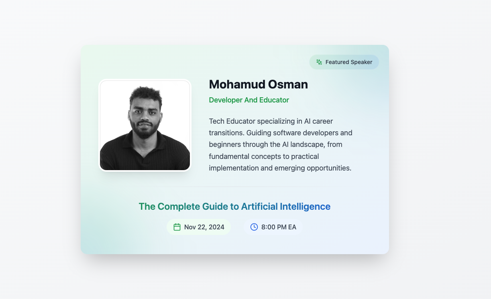

# The Complete Guide to Artificial Intelligence
*A comprehensive, self-explanatory guide for anyone interested in understanding and pursuing AI*

## Introduction to AI: The Foundation

### What Really Is Artificial Intelligence?
Imagine trying to explain color to someone who has never seen it. AI can be similarly abstract, so let's break it down into something tangible.

#### The Simple Definition
Artificial Intelligence is like giving computers the ability to "learn" instead of just following strict rules. Think of it this way:

**Traditional Computer Program:**
- Like following a cooking recipe exactly
- Can only do what it's specifically told
- Breaks if it encounters something new

**AI System:**
- Like a chef who learns from experience
- Can adapt to new situations
- Gets better with more practice

#### Real-World Example You Use Every Day
When you take a photo and your phone automatically focuses on faces, that's AI in action:
- It recognizes faces in any lighting
- It works with different angles
- It can identify multiple faces at once
- It keeps improving with newer models

### The Three Layers of AI Technology

#### 1. Artificial Intelligence (The Umbrella Term)
Think of AI as the entire universe of computer systems trying to mimic human intelligence.

**Real-World Example:**
Your smart home system is AI when it:
- Turns lights on before you get home
- Adjusts temperature based on your schedule
- Learns your preferences over time
- Makes decisions without your direct input

#### 2. Machine Learning (The Engine)
If AI is the car, Machine Learning is the engine. It's how computers learn from experience without being explicitly programmed.

**Real-World Example:**
Netflix's recommendation system:
- Observes what you watch
- Notes when you pause, rewind, or stop
- Learns from millions of other users
- Gradually improves its suggestions
- Adapts when your tastes change

#### 3. Deep Learning (The Specialist)
Deep Learning is like a highly specialized expert. It excels at complex patterns that even humans might miss.

**Real-World Example:**
Google Translate's camera feature:
- Recognizes text in images
- Understands context and language
- Maintains formatting
- Works in real-time
- Handles handwriting

### Why AI Is Different Now: The Perfect Storm

#### 1. The Data Explosion
Think of data as food for AI. Today we have:
- Smartphones generating location data
- Social media creating behavior data
- IoT devices collecting sensor data
- Online shopping tracking preference data

**Real-World Impact:**
Your maps app doesn't just know traffic patterns; it predicts them based on:
- Historical data from millions of drivers
- Current traffic conditions
- Weather data
- Event schedules
- Time of day

#### 2. Computing Power Revolution
Imagine trying to watch Netflix on a 1990s computer. Similarly, AI needed modern computing power to become practical.

**What Changed:**
- Gaming GPUs became AI processors
- Cloud computing made power accessible
- Specialized AI chips emerged
- Processing costs dropped dramatically

#### 3. Algorithm Breakthroughs
Like discovering new laws of physics, we've found better ways to make AI work.

**Practical Examples:**
- Face ID on your phone works in milliseconds
- Virtual assistants understand natural speech
- Cars can detect and avoid obstacles
- Phones can take professional-quality photos automatically

### How These Technologies Work Together

Imagine a self-driving car:
1. **AI** (Overall System)
   - Makes driving decisions
   - Handles unexpected situations
   - Interacts with other vehicles

2. **Machine Learning** (Core Functions)
   - Learns traffic patterns
   - Improves route planning
   - Adapts to driving conditions

3. **Deep Learning** (Specific Tasks)
   - Recognizes road signs
   - Identifies pedestrians
   - Understands traffic signals

### Common Misconceptions Corrected

#### Misconception 1: "AI Will Replace All Human Jobs"
**The Reality:**
- AI automates tasks, not entire jobs
- Creates new jobs (AI trainers, specialists)
- Changes job roles rather than eliminating them

**Example:**
Radiologists now use AI to:
- Screen routine cases faster
- Catch details they might miss
- Focus on complex diagnoses
- Spend more time with patients

#### Misconception 2: "AI Thinks Like Humans"
**The Reality:**
- AI recognizes patterns in data
- Doesn't understand meaning
- Can't truly "think" or "understand"

**Example:**
When AI plays chess:
- It doesn't "strategize" like humans
- It evaluates millions of possibilities
- Uses pattern matching from training
- Doesn't understand why moves work

# The Complete Guide to Artificial Intelligence - Part 2
*Understanding Career Paths and Industry Applications in AI*

## How AI is Changing Every Industry

### 1. Content Creation and Media
Today's AI can create, edit, and enhance content in ways that seemed impossible just a year ago:

#### What's Really Happening:
- Writers use AI to brainstorm and refine ideas
- Artists combine their creativity with AI generation
- Musicians use AI for composition and production
- Filmmakers use AI for special effects and editing

#### Real Example:
A modern content creator's workflow:
- Uses ChatGPT to outline articles
- Generates images with Midjourney
- Enhances photos with AI tools
- Creates multiple content versions quickly

### 2. Software Development
The way we write code has fundamentally changed:

#### Before AI (2022):
- Manually writing every line of code
- Searching Stack Overflow for solutions
- Time-consuming debugging
- Limited code reuse

#### Now With AI (2024):
- AI suggests code as you type
- Explains complex code instantly
- Converts comments to working code
- Automates testing and debugging

### 3. Healthcare and Medicine
AI is revolutionizing how healthcare works:

#### Current Applications:
- Disease detection from medical images
- Drug discovery and development
- Patient care personalization
- Treatment planning assistance

#### Real Example:
A modern medical diagnosis process:
- AI analyzes patient symptoms
- Suggests possible conditions
- Recommends relevant tests
- Helps doctors make informed decisions

## Career Paths in AI: A 2024 Perspective

### 1. AI Engineers: The Builders
Think of AI Engineers as the architects of artificial intelligence systems.

#### What They Actually Do:
- Design AI solutions for real problems
- Build and train AI models
- Deploy AI systems at scale
- Optimize AI performance

#### A Day in the Life:

- Review model performance metrics
- Adjust training parameters
- Debug AI behavior issues

- Implement new AI features
- Collaborate with product teams
- Test model improvements

### 2. AI Product Managers: The Visionaries
They bridge the gap between AI technology and real-world needs.

#### What They Actually Do:
- Identify AI opportunities
- Define product requirements
- Work with engineers and designers
- Ensure AI solves real problems

#### A Day in the Life:

- Review user feedback
- Plan feature improvements
- Meet with engineering teams

- Test new AI features
- Gather stakeholder input
- Plan product roadmap

### 3. Data Scientists: The Architects
They design how AI learns from data.

#### What They Actually Do:
- Analyze complex data sets
- Create learning algorithms
- Improve model accuracy
- Solve business problems

#### A Day in the Life:

- Data analysis
- Model evaluation
- Feature engineering

- Improve algorithms
- Present findings
- Collaborate with teams

## How to Start Your AI Career in 2024

### For Beginners: The Foundation Path

#### Month 1-3: Basic Skills
- Learn Python programming
- Understand data structures
- Master basic statistics

#### Month 4-6: AI Fundamentals
- Learn machine learning basics
- Understand neural networks
- Practice with simple projects

#### Month 7-9: Specialization
- Choose your focus area
- Build portfolio projects
- Join AI communities

### For Developers: The Transition Path

#### Month 1-2: AI Foundations
- Learn AI/ML concepts
- Understand model training
- Practice with AI tools

#### Month 3-4: Specialization
- Choose your area (NLP, Computer Vision, etc.)
- Build practical projects
- Learn relevant frameworks

#### Month 5-6: Advanced Skills
- Large language models
- Model deployment
- System optimization

### Essential Skills for AI Careers in 2024

#### Technical Skills:
1. Programming Languages:
   - Python (Primary)
   - SQL for data
   - JavaScript for deployment

2. AI/ML Frameworks:
   - PyTorch or TensorFlow
   - Hugging Face transformers
   - OpenAI APIs

3. Development Tools:
   - Git for version control
   - Docker for deployment
   - Cloud platforms (AWS, Azure)

#### Soft Skills:
1. Problem Solving:
   - Breaking down complex issues
   - Finding creative solutions
   - Analytical thinking

2. Communication:
   - Explaining technical concepts
   - Writing documentation
   - Team collaboration

3. Business Understanding:
   - Industry awareness
   - Product thinking
   - User empathy

# The Complete Guide to Artificial Intelligence - Part 3
*Essential Resources, Tools, and Learning Paths for AI in 2024*

## Modern AI Learning Resources: A Complete Guide

### 1. Online Learning Platforms
These platforms offer the most current and comprehensive AI education:

#### Top Learning Paths
1. **Fast.ai**
   - Why It's Different: Practical, top-down approach
   - Best For: Developers wanting hands-on experience
   - Cost: Free
   - Notable Course: "Practical Deep Learning for Coders"

2. **DeepLearning.AI**
   - Why It's Different: Created by Andrew Ng
   - Best For: Structured, comprehensive learning
   - Notable Courses: 
     * "Machine Learning Specialization"
     * "AI For Everyone"
     * "ChatGPT Prompt Engineering"

3. **Hugging Face**
   - Why It's Different: Focus on modern AI tools
   - Best For: Learning current AI development
   - Notable Resources:
     * NLP Course
     * Model Training Tutorials
     * Real-world Projects

### 2. Essential AI Tools for Learning

#### Development Environments
1. **Google Colab**
   - What: Free cloud-based notebooks
   - Why: No setup required
   - Best For: Learning and experimentation
   - Features: Free GPU access

2. **Jupyter Notebooks**
   - What: Interactive development
   - Why: Industry standard
   - Best For: Data analysis and model development
   - Features: Local development control

### 3. Modern AI Frameworks

#### For Beginners
1. **PyTorch**
   - Why Learn: Industry favorite
   - Best Starting Point: PyTorch tutorials
   - Key Features: Easy debugging
   - Real Use: Meta, OpenAI, Microsoft

2. **TensorFlow**
   - Why Learn: Enterprise standard
   - Best Starting Point: TensorFlow basics
   - Key Features: Production deployment
   - Real Use: Google, Intel, Twitter

#### For Advanced Learners
1. **Hugging Face Transformers**
   - What: Modern NLP tools
   - Why: Industry standard for LLMs
   - Key Features: Pre-trained models
   - Real Applications: Text, speech, vision

2. **LangChain**
   - What: LLM development framework
   - Why: Building AI applications
   - Key Features: Chain multiple AI tools
   - Real Use: Building AI products

## Modern AI Project Ideas

### 1. Beginner Projects
Start with these to build foundation:

#### Text-Based Projects
1. **Sentiment Analyzer**
   - Skills Learned: Basic NLP
   - Tools Used: Hugging Face
   - Difficulty: Entry Level
   - Real Application: Customer feedback analysis

2. **Chat Assistant**
   - Skills Learned: LLM integration
   - Tools Used: OpenAI API
   - Difficulty: Beginner
   - Real Application: Customer service

### 2. Intermediate Projects
Build real-world applications:

#### Practical Applications
1. **Content Generator**
   - What: Multi-format content creation
   - Tools: GPT-4, DALL-E, Stable diffusion, Flux
   - Skills: API integration
   - Real Use: Marketing automation

2. **Code Assistant**
   - What: Programming helper
   - Tools:  GitHub Copilot API, claude, ,
   - Skills: Development workflows
   - Real Use: Developer productivity

### 3. Advanced Projects
Professional-level development:

#### Industry-Level Projects
1. **AI-Powered Analytics**
   - What: Business intelligence tool
   - Tools: Multiple AI services
   - Skills: System integration
   - Real Use: Business decisions

2. **Custom Language Model**
   - What: Specialized AI assistant
   - Tools: Fine-tuning frameworks
   - Skills: Advanced ML
   - Real Use: Domain-specific applications

## Practical Learning Paths

### 1. For Complete Beginners
A structured approach:

#### First Month
- Learn Python basics
- Understand AI concepts
- Practice with simple tools

#### Second Month
- Basic ML concepts
- Work with datasets
- Build simple models

#### Third Month
- Choose specialization
- Start real projects
- Join AI communities

### 2. For Developers
Transition to AI development:

#### First Month
- AI/ML fundamentals
- Framework basics
- Simple integrations

#### Second Month
- Advanced frameworks
- Model deployment
- Real applications

#### Third Month
- Specialization
- Portfolio building
- Industry projects

## Community and Networking

### 1. Online Communities
Where to learn and grow:

#### Active Communities
1. **Discord Servers**
   - Hugging Face Community
   - Python Developers
   - AI Enthusiasts

2. **Reddit Communities**
   - r/learnmachinelearning
   - r/artificial
   - r/MachineLearning

### 2. Professional Networks
Build your career:

#### Platforms
1. **LinkedIn Groups**
   - AI Professionals
   - Machine Learning Engineers
   - Data Science Network

2. **GitHub**
   - Open Source Projects
   - Code Contributions
   - Portfolio Building

## Staying Updated

### 1. Key Resources
For continuous learning:

#### Regular Reading
1. **Newsletters**
   - Import AI
   - The Batch
   - ML News

2. **Blogs**
   - OpenAI Blog
   - Google AI Blog
   - Papers with Code

---

**Thanks**